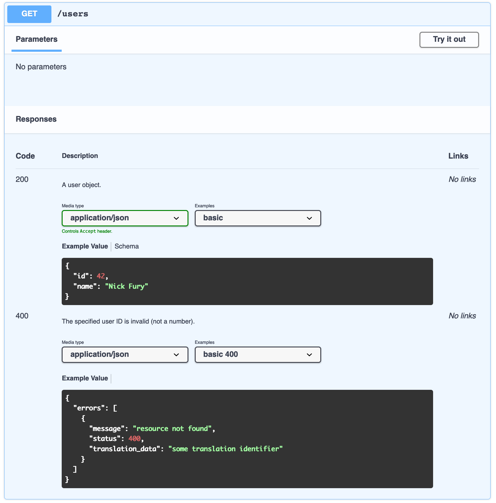

> I need to add JSON examples to OpenAPI from files

Add to your `openapi.yaml` annotation `#source <filepath>` like bellow:

```yaml
openapi: 3.0.0
info:
  version: 1.0.0
  title: Swagger Marvelstore

paths:
  /users:
    get:
      responses:
        '200':
          description: A user object.
          content:
            application/json:
              schema:
                type: object
                properties:
                  id:
                    type: integer
                    format: int64
                    example: 4
                  name:
                    type: string
                    example: Jessica Smith
              examples:
                basic:
                  value: #source testdata/user-basic.json
        '400':
          description: The specified user ID is invalid (not a number).
          content:
            application/json:
              examples:
                basic 400:
                  value: #source testdata/error-400.json
```

.. then run `cat openapi.yaml | go run main.go > openapi.new.yaml` which will produce bellow

```yaml
openapi: 3.0.0
info:
  version: 1.0.0
  title: Swagger Marvelstore

paths:
  /users:
    get:
      responses:
        '200':
          description: A user object.
          content:
            application/json:
              schema:
                type: object
                properties:
                  id:
                    type: integer
                    format: int64
                    example: 4
                  name:
                    type: string
                    example: Jessica Smith
              examples:
                basic:
                  value: {"id":42,"name":"Nick Fury"} #source testdata/user-basic.json
        '400':
          description: The specified user ID is invalid (not a number).
          content:
            application/json:
              examples:
                basic 400:
                  value: {"errors":[{"message":"resource not found","status":400,"translation_data":"some translation identifier"}]} #source testdata/error-400.json
```

.. this will render nicely as multiple examples that you can select



Why would you need this?

- Keep your OpenAPI up to date with values you use in tests
- Can run multiple times
- UNIX filter
- does not corrupt anything if fails at any stage
- 100% test coverage